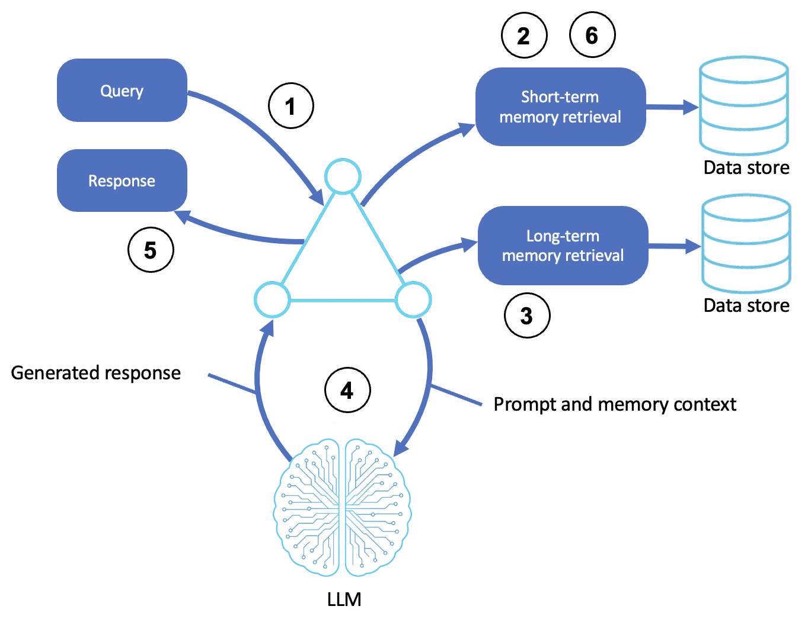

# Memory-Augmented Agents

Agents that reason over short-term and long-term memory so they stay coherent across a long conversation and remember context between sessions.

This sample builds memory-augmented agents with the [Strands Agents SDK](https://strandsagents.com/) and is based off of the [AWS Prescriptive Guidance - Memory-augmented agents pattern](https://docs.aws.amazon.com/prescriptive-guidance/latest/agentic-ai-patterns/memory-augmented-agents.html).

## Table of Contents

- [Quick Start](#quick-start)
- [Memory Patterns](#memory-patterns)
  - [How It Works](#how-it-works)
  - [Sliding Window](#sliding-window)
  - [Summarization](#summarization)
  - [Persistent Sessions](#persistent-sessions)
- [AWS Implementation Patterns](#aws-implementation-patterns)
- [Reference](#reference)

## Quick Start

**Prerequisites:**
- Python 3.10+
- An AWS account with Amazon Bedrock access
- AWS credentials configured (`aws configure`) with permission to invoke models on Bedrock

```bash
# Create and activate virtual environment
python3 -m venv venv
source venv/bin/activate  # On Windows: venv\Scripts\activate

# Install dependencies
pip install -r requirements.txt

# Point the sample at your AWS profile and region (loaded by shared/model.py)
cp .env.example .env
# Edit .env: set AWS_PROFILE and AWS_REGION. Optionally pin a model with STRANDS_MODEL_ID.

# Run any of the three memory patterns
python sliding_window_agent.py      # keep the last N messages (set to 10)
python summarizing_memory_agent.py  # compress old messages into a summary
python persistent_session_agent.py  # remember across restarts
```

> **Note:** `persistent_session_agent.py` writes session state to `08-memory-augmented-agents/.sessions/` (next to the script, whatever directory you run it from) so the agent remembers you across restarts.

**Try these exercises:**
1. **Prove persistence.** In `persistent_session_agent.py`, share a detail, `quit`, restart with the same session ID, and ask it to recall.
2. **Hit the window edge.** In `sliding_window_agent.py`, tell it your name, send 10+ more messages, then ask if it still remembers.
3. **Compare retention.** Give the same long conversation to the sliding-window and summarizing agents and see which still recalls an early fact.

---

## Memory Patterns

A stateless agent treats every message as if it were the first. Memory changes that by carrying context forward. However, context windows are finite, so the real question is *which* context to keep and *how*. This sample builds three foundational memory agents: keep the recent messages (**sliding window**), compress the old ones (**summarizing**), or save everything across sessions (**persistent**).

### How It Works

1. **Receives input or event**: the agent gets a user query or system event — text, an API trigger, or an environmental change
2. **Retrieves short-term memory**: it pulls recent conversation history, task context, or session state
3. **Retrieves long-term memory**: it queries long-term stores (vector databases, key-value stores) for user preferences, past decisions and outcomes, and learned summaries
4. **Reasons through the LLM**: the memory context is embedded into the prompt, so the agent reasons over both current input and prior knowledge
5. **Generates outputs**: it produces a contextually aware, personalized response, plan, or action
6. **Updates memory**: new information is stored for future tasks



> **Note:** Strands handles short-term memory through [conversation managers](https://strandsagents.com/docs/user-guide/concepts/agents/conversation-management/) and cross-session memory through [session managers](https://strandsagents.com/docs/user-guide/concepts/agents/session-management/). For *why* memory turns a reactive tool into an adaptive collaborator, see the [companion blog](Agents%20That%20Remember%20-%20Context%20Windows%2C%20Summaries%2C%20and%20Persistent%20Sessions.md).

### Sliding Window

The [sliding window agent](sliding_window_agent.py) keeps only the most recent messages and drops older ones, so the conversation never overflows the context window. It's the simplest strategy which sets a window size and lets old turns fall off:

```python
from strands.agent.conversation_manager.sliding_window_conversation_manager import (
    SlidingWindowConversationManager,
)

agent = Agent(
    system_prompt=SYSTEM_PROMPT,
    conversation_manager=SlidingWindowConversationManager(window_size=10),
    callback_handler=None,
)
```

Use a sliding window when only recent context matters (most chat) and simplicity wins. The trade-off: anything older than the window is simply forgotten.

### Summarization

The [summarization agent](summarizing_memory_agent.py) takes a more sustainable approach. Instead of dropping old messages, it **summarizes** them, preserving key facts while reclaiming context space:

```python
from strands.agent.conversation_manager.summarizing_conversation_manager import (
    SummarizingConversationManager,
)

agent = Agent(
    system_prompt=SYSTEM_PROMPT,
    conversation_manager=SummarizingConversationManager(
        summary_ratio=0.3,            # summarize when ~30% of context is used
        preserve_recent_messages=10,  # keep the last 10 verbatim
    ),
    callback_handler=None,
)
```

Use summarization when early facts still matter many turns later, at the cost of extra model calls to produce the summaries, and some loss of verbatim detail.

### Persistent Sessions

The [persistent session agent](persistent_session_agent.py) reaches *across* runs: a `FileSessionManager` saves conversation state to disk, so the agent recalls you after the script restarts:

```python
from strands.session.file_session_manager import FileSessionManager

session_manager = FileSessionManager(session_id="default-user", storage_dir=".sessions")
agent = Agent(system_prompt=SYSTEM_PROMPT, session_manager=session_manager, callback_handler=None)
```

Each `session_id` is an isolated memory; type `new` in the sample to branch a fresh one. The sample uses file storage for local development but in a more professional environment, you'd simply swap in a managed store (Amazon DynamoDB, Amazon S3) without changing the agent.

---

## AWS Implementation Patterns

| Pattern | Description | Reference |
|---------|-------------|-----------|
| Managed agent memory | Build context-aware agents with Amazon Bedrock AgentCore Memory | [Amazon Bedrock AgentCore Memory: Building context-aware agents](https://aws.amazon.com/blogs/machine-learning/amazon-bedrock-agentcore-memory-building-context-aware-agents/) |
| Long-term memory deep dive | Design durable long-term memory for AI agents with AgentCore | [Building smarter AI agents: AgentCore long-term memory deep dive](https://aws.amazon.com/blogs/machine-learning/building-smarter-ai-agents-agentcore-long-term-memory-deep-dive) |
| Durable memory on DynamoDB | Persist agent state durably using Amazon DynamoDB | [Build durable AI agents with LangGraph and Amazon DynamoDB](https://aws.amazon.com/blogs/database/build-durable-ai-agents-with-langgraph-and-amazon-dynamodb/) |
| Semantic memory for agents | Use Amazon OpenSearch Serverless for embedding-based (RAG) long-term memory | [The next generation of Amazon OpenSearch Serverless, built for agents](https://aws.amazon.com/blogs/big-data/the-next-generation-of-amazon-opensearch-serverless-built-from-the-ground-up-for-agents/) |

## Reference

- [Companion blog post: Agents That Remember](Agents%20That%20Remember%20-%20Context%20Windows%2C%20Summaries%2C%20and%20Persistent%20Sessions.md)
- [AWS Prescriptive Guidance - Memory-augmented agents](https://docs.aws.amazon.com/prescriptive-guidance/latest/agentic-ai-patterns/memory-augmented-agents.html)
- [Strands conversation management](https://strandsagents.com/docs/user-guide/concepts/agents/conversation-management/)
- [Strands session management](https://strandsagents.com/docs/user-guide/concepts/agents/session-management/)
- [Amazon Bedrock User Guide](https://docs.aws.amazon.com/bedrock/latest/userguide/what-is-bedrock.html)

### The series

This sample is one of eleven, one per pattern in the [AWS Prescriptive Guidance on agentic AI patterns](https://docs.aws.amazon.com/prescriptive-guidance/latest/agentic-ai-patterns/). Each has a hands-on sample repository and a companion blog post explaining the concepts.

| # | Pattern | Sample | Blog |
|---|---|---|---|
| 01 | Basic Reasoning Agents | [sample-basic-reasoning-agents](https://github.com/aws-samples/sample-basic-reasoning-agents) | [Building Basic Reasoning Agents with Amazon Bedrock and Strands SDK](https://github.com/aws-samples/sample-basic-reasoning-agents/blob/main/Building%20Basic%20Reasoning%20Agents%20with%20Amazon%20Bedrock%20and%20Strands%20SDK.md) |
| 02 | Tool-Based Agents (Functions) | [sample-tool-based-agents-functions](https://github.com/aws-samples/sample-tool-based-agents-functions) | [Extending AI Agents with Custom Tools and Functions](https://github.com/aws-samples/sample-tool-based-agents-functions/blob/main/Extending%20AI%20Agents%20with%20Custom%20Tools%20and%20Functions.md) |
| 03 | Tool-Based Agents (Servers) | [sample-tool-based-agents-servers](https://github.com/aws-samples/sample-tool-based-agents-servers) | [Delegating Work: Tool Servers and the Model Context Protocol](https://github.com/aws-samples/sample-tool-based-agents-servers/blob/main/Delegating%20Work%20-%20Tool%20Servers%20and%20the%20Model%20Context%20Protocol.md) |
| 04 | Computer-Use Agents | [sample-computer-use-agents](https://github.com/aws-samples/sample-computer-use-agents) | [Agents That Use Computers: Browsers, Desktops, and the GUI Frontier](https://github.com/aws-samples/sample-computer-use-agents/blob/main/Agents%20That%20Use%20Computers%20-%20Browsers%2C%20Desktops%2C%20and%20the%20GUI%20Frontier.md) |
| 05 | Coding Agents | [sample-coding-agents](https://github.com/aws-samples/sample-coding-agents) | [Coding Agents: From Autocomplete to Autonomous Software Work](https://github.com/aws-samples/sample-coding-agents/blob/main/Coding%20Agents%20-%20From%20Autocomplete%20to%20Autonomous%20Software%20Work.md) |
| 06 | Speech and Voice Agents | [sample-speech-voice-agents](https://github.com/aws-samples/sample-speech-voice-agents) | [Giving Agents a Voice: Speech-to-Speech and the STT/TTS Pipeline](https://github.com/aws-samples/sample-speech-voice-agents/blob/main/Giving%20Agents%20a%20Voice%20-%20Speech-to-Speech%20and%20the%20STT-TTS%20Pipeline.md) |
| 07 | Workflow Orchestration Agents | [sample-workflow-orchestration-agent](https://github.com/aws-samples/sample-workflow-orchestration-agent) | [Orchestrating Agents: Sequential, Parallel, and Conditional Workflows](https://github.com/aws-samples/sample-workflow-orchestration-agent/blob/main/Orchestrating%20Agents%20-%20Sequential%2C%20Parallel%2C%20and%20Conditional%20Workflows.md) |
| 08 | Memory-Augmented Agents | this repository | [Agents That Remember: Context Windows, Summaries, and Persistent Sessions](Agents%20That%20Remember%20-%20Context%20Windows%2C%20Summaries%2C%20and%20Persistent%20Sessions.md) |
| 09 | Simulation and Test-Bed Agents | [sample-simulation-testbed-agents](https://github.com/aws-samples/sample-simulation-testbed-agents) | [Practice Worlds: Simulation and Test-Bed Agents](https://github.com/aws-samples/sample-simulation-testbed-agents/blob/main/Practice%20Worlds%20-%20Simulation%20and%20Test-Bed%20Agents.md) |
| 10 | Observer and Monitoring Agents | [sample-observer-monitoring-agents](https://github.com/aws-samples/sample-observer-monitoring-agents) | [Watching the Watched: Observer and Monitoring Agents](https://github.com/aws-samples/sample-observer-monitoring-agents/blob/main/Watching%20the%20Watched%20-%20Observer%20and%20Monitoring%20Agents.md) |
| 11 | Multi-Agent Collaboration | [sample-multi-agent-collaboration](https://github.com/aws-samples/sample-multi-agent-collaboration) | [When Multi-Agent Collaboration Earns Its Cost](https://github.com/aws-samples/sample-multi-agent-collaboration/blob/main/When%20Multi-Agent%20Collaboration%20Earns%20Its%20Cost.md) |

## Security

See [CONTRIBUTING](CONTRIBUTING.md#security-issue-notifications) for more information.

## License

This library is licensed under the MIT-0 License. See the LICENSE file.
